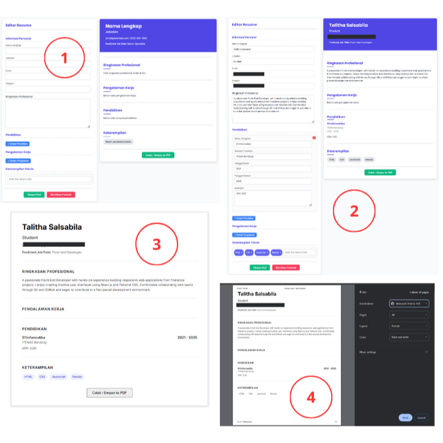

## Resume Builder and Job Title Predictor
This project is a Python-based **Resume Builder** that also functions as a **Job Title Predictor**. It leverages natural language processing (NLP) techniques to help users create resumes and then suggests potential job titles based on the resume content.

### Features
  * **Interactive Resume Building:** A web interface built with **Flask** allows users to directly input their resume details.
  * **Save as PDF:** Users can **save their generated resume as a PDF file** for easy sharing and printing.
  * **NLP-Powered Job Title Prediction:** Uses the content of the generated resume, specifically the professional summary, to predict relevant job titles.
  * **Multi-language Stemming Support:**
      * **English:** Employs the **NLTK Porter Stemmer** for English text processing.
      * **Indonesian:** Integrates **Sastrawi Stemmer** for accurate stemming of Indonesian text.
  * **Machine Learning Integration:** Employs **Joblib** for efficient loading and prediction with a pre-trained **Naive Bayes** machine learning model.

### Demo / Screenshots

1.  Resume Input Form
2.  Generated Resume Preview and Job Title Prediction
3 & 4. Resume View for PDF Export

## How Job Title Prediction Works
The core of the job title prediction functionality relies on a **pre-trained Naive Bayes Classifier**. This model, along with its associated TF-IDF vectorizer (used to convert text into numerical features), is stored as **`.pkl` files**. When a user enters their professional summary into the application, the following steps occur:
1.  **Loading the Model (`.pkl` file):** The pre-trained Naive Bayes model and TF-IDF vectorizer are loaded from their respective **`.pkl` files** using `joblib.load()`. This `.pkl` format ensures that the entire state of the trained model is preserved and can be quickly retrieved.
2.  **Text Preprocessing:** The user-inputted professional summary undergoes several NLP preprocessing steps:
      * **Tokenization:** The text is broken down into individual words or tokens.
      * **Stemming:** Words are reduced to their root form using **NLTK Porter Stemmer** for English and **Sastrawi Stemmer** for Indonesian. This ensures consistency regardless of word variations (e.g., "developer," "developing," "developed" all become "develop").
      * **(Optional) Stopword Removal:** Common words that contribute little to meaning (such as "and", "or", "is") may also be removed.
3.  **Feature Extraction (TF-IDF):** The preprocessed text is then transformed into numerical features using the **loaded TF-IDF vectorizer**. TF-IDF assigns higher weights to words that are important and unique to a particular job title category.
4.  **Naive Bayes Classification:** The extracted features are fed into the **loaded Naive Bayes model**. Naive Bayes is a probabilistic classifier that calculates the probability of a resume belonging to a certain job title category based on the frequency of words in its professional summary.
5.  **Prediction Output:** The model outputs the most probable job title(s) based on these calculations, providing data-driven suggestions to the user.
   
### Limitations
**Prediction Scope:** The job title prediction feature is currently **limited to descriptions and professional summaries within the IT (Information Technology) domain**. The underlying model was trained specifically on IT-related job titles and descriptions, so its accuracy may be reduced for resumes in other industries.

### Installation
1.  **Clone the repository:**
    ```bash
    git clone https://github.com/talithsa/Resume-Builder-NLP.git
    cd Resume-Builder-NLP # Navigate into the cloned directory
    ```
2.  **Create a Virtual Environment (highly recommended):**
    ```bash
    python -m venv venv
    source venv/bin/activate  # For Linux/macOS
    venv\Scripts\activate     # Or For Windows
    ```
3.  **Install Dependencies:**
    ```bash
    pip install Flask NLTK Sastrawi joblib scikit-learn [your-pdf-library-name] # (e.g., `xhtml2pdf`, `ReportLab`, `PyFPDF`)
    ```
4.  **Download NLTK Data:**
    ```python
    import nltk
    nltk.download('punkt')
    nltk.download('stopwords') # If you are using stopwords
    ```

### Usage
1.  **Run the Flask application:**
    ```bash
    python main.py
    # Ensure you are in the project directory and your `venv` environment is active.
    ```
2.  **Access the Application:**
    Open your web browser and navigate to `http://127.0.0.1:5000/` (or the address displayed in your terminal).
3.  **Build Your Resume:**
    Use the provided interface to enter your resume details.
4.  **Get Job Title Predictions:**
    After submitting your resume, the application will process the text and display relevant job title predictions.
5.  **Save as PDF:**
    Look for the option to save your resume as a PDF within the application's interface.
